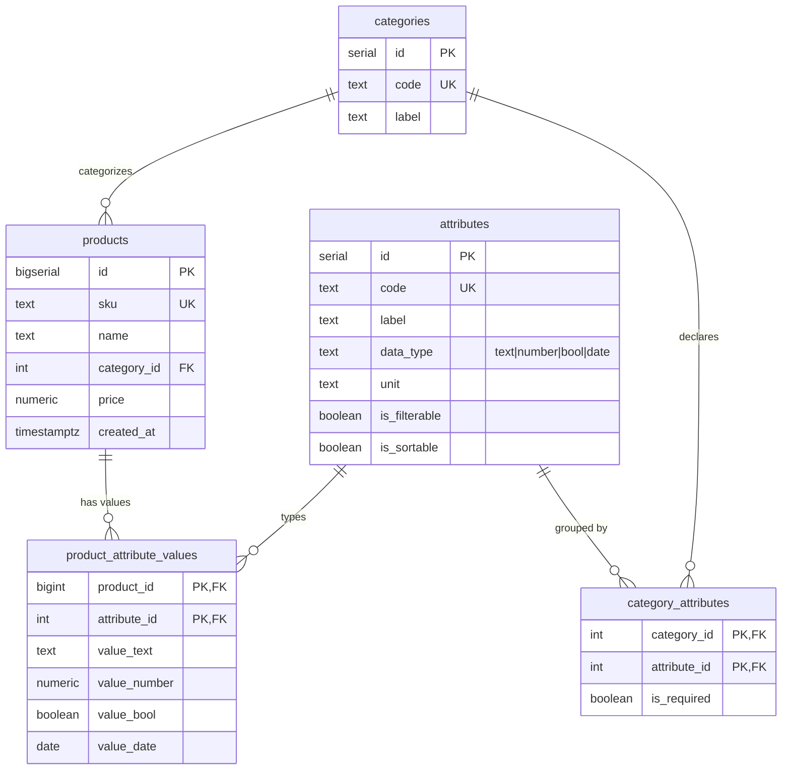

# Architecture — EAV Product Catalog

This document explains the database schema: what each table is for, why it
exists, and how far the design can be simplified (including the question "do we
really need the `categories` table?").

---

## 1. The big picture

A web store sells products of **different kinds** (books, t-shirts, laptops).
Each kind has its **own set of attributes** — a book has an author and page
count, a laptop has a CPU and RAM. A single wide `products` table would need one
column per possible attribute, so it would be mostly `NULL` and would require a
schema migration (DDL) every time the business adds an attribute.

**EAV (Entity–Attribute–Value)** turns that around: an attribute value is a
*row*, not a *column*. Adding an attribute becomes inserting data, not altering
a table. We use the **typed** variant — one physical column per data type
(`value_text`, `value_number`, `value_bool`, `value_date`) — so values keep
their native type and B-tree indexes/range filters/numeric sorts work correctly.

### Entity–relationship diagram



The tables split into **three concerns**:

| Concern | Tables | Role |
|---------|--------|------|
| **Metadata** (schema-as-data) | `categories`, `attributes`, `category_attributes` | Describe *what can exist* — the catalog's shape |
| **Entities** | `products` | The actual things being sold |
| **Values** (the EAV core) | `product_attribute_values` | The heterogeneous, category-specific data |

---

## 2. Why each table exists

### `products` — the Entity

The thing being sold. Holds the columns that **every** product has regardless of
category: `sku`, `name`, `price`, `created_at`, and a `category_id`.

- **Why it's separate from EAV:** common/hot columns stay relational. `price`
  lives here (not in EAV) because *every* product has a price, it is filtered and
  sorted constantly, and keeping it a real `NUMERIC` column means fast indexed
  range queries (`price < 100`) with no join. This "hybrid" rule — stable columns
  relational, variable tail in EAV — is what keeps EAV usable.
- **Without it:** you'd have no anchor row per product and nowhere to enforce
  `sku` uniqueness or a per-product FK target.

**Why the `sku` column (vs just `id`)?** `sku` (Stock Keeping Unit) is the
product's **business identifier**, deliberately distinct from the surrogate `id`:

- `id` is a `BIGSERIAL` — a DB-internal number that changes between environments,
  re-seeds and imports. External systems (warehouses, invoices, barcodes, catalog
  URLs, ERP/marketplace feeds) reference the **SKU**, never the auto-increment id.
- `sku TEXT UNIQUE NOT NULL` enforces a real business rule — "no duplicate
  listings" — which a surrogate `id` cannot express (every `id` is trivially
  unique, so it constrains nothing meaningful).
- It's the **stable natural key for import/export**: rows are matched across
  systems by SKU while `id` is regenerated on each load.
- In this codebase it's also functional: the bulk seeder does
  `INSERT … RETURNING id, sku` and builds an `idBySku` map to attach the right
  attribute-value rows to each just-inserted product (the `id`s aren't known
  until after the insert).

For a bare-minimum EAV demo you *could* drop `sku` and use `id` everywhere — it's
kept because it's what makes `products` a realistic catalog entity.

### `attributes` — the Attribute dictionary (metadata)

Defines each attribute **once**: its `code` (`ram_gb`), `label` (`RAM`),
`data_type`, `unit`, and the `is_filterable` / `is_sortable` flags.

- **Why we need it:** this is the "schema" of the flexible part, stored as data.
  It answers three questions the application constantly asks:
  1. **Which `value_*` column holds this attribute's value?** (`data_type`)
  2. **Can the user filter / sort by it?** (`is_filterable`, `is_sortable`) —
     these flags are the security whitelist that makes dynamic query building
     injection-safe, and they drive which inputs the UI renders.
  3. **How is it labelled/united in the UI?** (`label`, `unit`)
- **Without it:** every consumer would have to hard-code attribute names and
  types in application code, and the dynamic-filter API would have no whitelist
  to validate against — you'd be interpolating user-supplied column intents into
  SQL. It also prevents typos: `product_attribute_values.attribute_id` is a FK, so
  you can't store a value for an attribute that doesn't exist.

### `product_attribute_values` — the Value table (EAV core)

One row per `(product, attribute)`: `product_id`, `attribute_id`, and the four
typed value columns (exactly one non-null, enforced by
`CHECK (num_nonnulls(...) = 1)`).

- **Why we need it:** this *is* the pattern — it stores the heterogeneous,
  category-specific data without a column-per-attribute wide table.
- **Key design points:**
  - Composite PK `(product_id, attribute_id)` = "one value per attribute per
    product" **and** the index for reconstructing a product.
  - Typed columns (vs one `value TEXT`) so `value_number >= 16` and
    `ORDER BY value_number` are correct and index-friendly. Stringly-typed EAV
    sorts `'8'` after `'64'`.

### `category_attributes` — which attributes belong to which category

A many-to-many join (`category_id`, `attribute_id`, `is_required`) saying "books
have author/pages/isbn/published", etc.

- **Why we need it:** it's the difference between "an attribute *exists*" and "an
  attribute *applies to this category*." The app uses it to:
  - build the **per-category form** (create/edit shows only that category's
    fields) and the **per-category filter panel**;
  - **validate** create/update — reject `ram_gb` on a book;
  - optionally enforce required attributes (`is_required`).
- **Without it:** you could not tell, up front, which attributes a category
  should have. You'd have to *infer* it from existing values
  (`SELECT DISTINCT attribute_id … WHERE category = books`), which breaks for
  empty categories, optional attributes, and newly-added attributes that no
  product uses yet. So it earns its place the moment you have metadata-driven UI
  or validation.

---

## 3. Can it be simplified?

Short answer: **yes, depending on how much you're willing to give up.** Here is
each table ranked by how safely it can be removed.

| Table | Removable? | What you lose |
|-------|-----------|---------------|
| `product_attribute_values` | ❌ Never | It's the EAV pattern itself |
| `attributes` | ❌ In practice no | The type map + filter/sort whitelist + labels; without it dynamic querying is unsafe and app code hard-codes everything |
| `products` | ❌ No | The entity anchor, `sku` uniqueness, relational `price` |
| `category_attributes` | ⚠️ Optional | Per-category forms/validation; you'd infer attribute sets from data (fragile) |
| `categories` | ⚠️ Optional | See below |

### Do we need the `categories` table?

**For this demo's requirements: not strictly — but keeping it is the right call.**

`categories` does three small jobs:
1. gives products a **normalized FK** (`category_id`) instead of a repeated
   string;
2. stores a **display `label`** separate from the machine `code`;
3. is the **grouping target** for `category_attributes`.

**Minimal alternative — drop `categories`:** replace `products.category_id` with
a plain `products.category TEXT` column, and key `category_attributes` by that
text value:

```sql
products            ( …, category TEXT NOT NULL )          -- 'laptops'
category_attributes ( category TEXT, attribute_id INT, … ) -- 'laptops' + FK to attributes
```

That works and removes a table + a join. What you give up:
- **Referential integrity** — nothing stops a typo (`'labtops'`) from creating a
  phantom category; a FK to `categories` does.
- **A home for category metadata** — real catalogs grow category label, slug,
  parent (hierarchy), sort order, icon, "active" flag. The moment you need any of
  those, the text column becomes a table again.
- **Cheap consistent renames/labels** — with a lookup table, the display name
  lives in one row.

**Verdict:** with only 3 fixed categories you *could* inline it as a text column
and lose little today. But `categories` is one tiny table (3 rows) that buys FK
safety and an obvious extension point, so the simplification isn't worth it. Keep
it. The table that's genuinely "optional-by-taste" is `category_attributes`, and
even that pays for itself as soon as you have a metadata-driven UI (which we do).

### The simplification that actually matters

The high-value knob is **not** removing metadata tables — it's deciding **how
much stays in EAV at all**. In rough order of preference:

1. **Hybrid (what this repo does):** hot/common columns relational (`price`),
   variable tail in typed EAV. Best default.
2. **JSONB instead of the value table:** replace `product_attribute_values` with
   a `products.attrs JSONB` column (+ GIN index). Fewer tables, natural
   whole-product reads, but weaker per-attribute typing/constraints and different
   index tuning. `attributes`/`category_attributes` metadata stays useful.
3. **Per-category tables / wide tables:** best when attribute sets are few and
   stable — but every new attribute is a migration, which is exactly what EAV
   exists to avoid.

So: simplify by **moving data out of EAV** (hybrid, or JSONB) — not by deleting
the small metadata tables that make the EAV part safe and self-describing.

---

## 4. Filtering & sorting — the SQL and its EXPLAIN

The API turns query params into SQL in `utils/query-builder.js`. Every attribute
predicate becomes **one self-join** of the value table; `price` and `category`
stay relational. This section walks the actual plans (`?explain=1` in the API, or
`npm run demo`) so you can see *why* it behaves the way it does.

### 4.1 Multi-attribute filter — `color=red AND size=M AND price<100`

Generated SQL (t-shirts, sorted by the relational `price`):

```sql
SELECT p.id, p.sku, p.name, p.price::float8 AS price, cat.code AS category
FROM products p
JOIN categories cat ON cat.id = p.category_id
JOIN product_attribute_values f0 ON f0.product_id = p.id
     AND f0.attribute_id = $2 AND f0.value_text = $3   -- color = 'red'
JOIN product_attribute_values f1 ON f1.product_id = p.id
     AND f1.attribute_id = $4 AND f1.value_text = $5   -- size  = 'M'
WHERE cat.code = $1 AND p.price < $6
ORDER BY p.price ASC NULLS LAST
LIMIT 20 OFFSET 0;
```

Condensed `EXPLAIN (ANALYZE)`:

```
Limit  rows=20
└─ Sort  Key: p.price   (top-N heapsort, 29kB)
   └─ Nested Loop        (est rows=1  →  actual rows=227)   ← estimate way off
      └─ Hash Join  (f1.product_id = f0.product_id)
         ├─ Index Scan idx_pav_attr_text  f1  (attribute_id=size,  value_text='M')    rows=2498
         └─ Hash ← Index Scan idx_pav_attr_text  f0  (attribute_id=color, value_text='red')  rows=1187
      └─ Index Scan products_pkey  p   Filter: price < 100   loops=284
Execution Time: ~4 ms
```

What to read from it:

- **Each `f_<code>` predicate is served by the partial per-type index**
  `idx_pav_attr_text (attribute_id, value_text) WHERE value_text IS NOT NULL`. The
  index key is `(attribute_id, value)`, so `attribute_id = color AND value = 'red'`
  is a tight range scan — this is what makes attribute equality fast.
- **The two attribute filters are joined *to each other* first** (hash join on
  `product_id`), then the surviving product ids probe `products` by PK. The
  planner intersects the two cheapest sets before touching the entity table.
- **Estimate vs actual is badly off (1 vs 227).** The planner has no idea that
  "red" and "size M" are correlated (or not) — it multiplies independent
  selectivities and lands on ~1 row. With 2 attributes it's harmless; at 4–5 it
  drives bad join orders. This is *the* EAV planning weakness, made concrete.
- **Sorting by `price` is cheap** — it's a relational column, top-N heapsort over
  the 227 survivors.

### 4.2 Typed sort on an EAV attribute — laptops by `ram_gb` desc

Sorting on an EAV attribute is a different animal. The builder adds a **LEFT
JOIN** to the value table (so products missing the attribute still appear, sorted
last) and orders by the typed column:

```sql
... FROM products p
JOIN categories cat ON cat.id = p.category_id
LEFT JOIN product_attribute_values srt ON srt.product_id = p.id
     AND srt.attribute_id = $ram_gb
WHERE cat.code = 'laptops'
ORDER BY srt.value_number DESC NULLS LAST
LIMIT 20;
```

```
Limit  rows=20
└─ Sort  Key: srt.value_number DESC   (top-N heapsort)
   └─ Nested Loop Left Join   actual rows=10000          ← EVERY laptop materialized
      ├─ Hash Join → Seq Scan on products   rows=30000
      └─ Index Scan pav_pkey  srt   loops=10000  (buffers hit=40000)
Execution Time: ~34 ms                                    ← ~8× the filtered query
```

The crucial contrast:

- **There is no filter to shrink the set, so to sort by `ram_gb` the DB must fetch
  every laptop's RAM value** — 10,000 PK look-ups into the value table (40,000
  buffer hits), *then* sort. The `idx_pav_attr_number` index does **not** help
  here: it orders values within an attribute, but we need "one specific value per
  product, then order by it" — a join, not a range.
- Compare with `ORDER BY p.price`: a **relational** column can be walked in index
  order (`idx_products_cat_price`) and the query can stop at `LIMIT 20`. An EAV
  attribute cannot — hence the 8× gap.
- **Takeaway / trick:** if an attribute is sorted often and unfiltered (default
  catalog ordering, "cheapest first", "newest first"), that is a strong signal to
  **promote it to a relational column** (the hybrid rule) rather than leave it in
  EAV. `is_sortable` in the metadata is a hint that such a column *might* be
  worth pulling out.

### 4.3 The count query

The response includes `total` for pagination via a sibling `COUNT(*)` over the
same joins/filters **without** `ORDER BY`/`LIMIT`. Its plan is the filter plan
minus the sort — same joins, ~4 ms. (See the `countSql`/`countValues` split in
`query-builder.js`: the count must **not** receive the `limit`/`offset`
parameters, or the bind fails.)

### 4.4 Tricks & gotchas for querying

- **Bind attribute ids, don't sub-select them per query.** The demo SQL uses
  `(SELECT id FROM attributes WHERE code=…)` for readability, which shows up as an
  `InitPlan` per attribute. The API instead **caches attribute metadata at
  startup** and passes `attribute_id` as a bound `$n` — fewer look-ups, cleaner
  plan.
- **Partial, per-type indexes are load-bearing.** `WHERE value_text IS NOT NULL`
  keeps each index small (only rows of that type) and keying by `attribute_id`
  first makes "this attribute, this value" a point/range scan. Without them every
  filter is a seq scan of the whole value table.
- **Push the cheap relational filter first.** `category` + `price` narrow the set
  before the EAV joins; `idx_products_cat_price` covers that.
- **More filters = more joins = worse estimates.** Two joins are fine; the 3-join
  breakdown demo (`13_breakdown_demo.sql`) shows the estimate collapse to `rows=1`
  vs hundreds actual. If you routinely filter on many attributes at once, that's
  the point to consider `CREATE STATISTICS`, a JSONB column with a GIN index, or
  materialized per-category tables.
- **`LIMIT` + top-N heapsort** keeps sorts cheap *when a filter shrank the set*.
  It does **not** save you when the sort itself forces a full-category scan (§4.2).
- **Guardrails are also a query concern.** Only `is_filterable`/`is_sortable`
  attributes reach the SQL, and codes are validated against the metadata
  whitelist — so a user can't inject `attribute_id`/column choices, and values are
  always parameterised.

---

## 5. Writing data — create product & category logic

Writes touch the three concerns in order: **metadata** first (categories +
attributes), then **entities + values** (products). All in `utils/repository.js`
and the setup SQL.

### 5.1 Creating categories & attributes (the metadata)

This is plain relational SQL (`scripts/setup/01_seed_categories.sql`) — the
"schema as data":

```sql
-- 1. categories
INSERT INTO categories (code, label) VALUES ('books','Books'), ('tshirts','T-Shirts'), ('laptops','Laptops');

-- 2. the attribute dictionary (typed once, here)
INSERT INTO attributes (code, label, data_type, unit, is_filterable, is_sortable)
VALUES ('ram_gb','RAM','number','GB', true, true), … ;

-- 3. attach attributes to categories via a set-based join (no row-by-row code)
INSERT INTO category_attributes (category_id, attribute_id, is_required)
SELECT c.id, a.id, true
FROM categories c
JOIN attributes a ON (c.code='laptops' AND a.code IN ('cpu','ram_gb','tdp_w','touchscreen')) OR … ;
```

**Trick:** step 3 builds the many-to-many with a single `INSERT … SELECT` join
rather than looking up ids in app code and inserting one row at a time — the id
resolution happens inside the database. Adding a new attribute to a category
later is one row in `category_attributes`; **no DDL, no migration** — that's the
whole EAV payoff on the write side.

### 5.2 Creating a product (entity + values, one transaction)

`repo.createProduct()` runs inside `BEGIN … COMMIT`:

```sql
BEGIN;

-- entity row; category code resolved to its id inline (one round trip)
INSERT INTO products (sku, name, category_id, price)
VALUES ($1, $2, (SELECT id FROM categories WHERE code = $3), $4)
RETURNING id;                                   -- → productId

-- one value row per supplied attribute, value routed to the typed column
INSERT INTO product_attribute_values
  (product_id, attribute_id, value_text, value_number, value_bool, value_date)
VALUES ($1, $2, $3, $4, $5, $6);                -- ×N, one per attribute

COMMIT;
```

Before it writes anything, it loads `allowedAttributes(category)` (a join over
`category_attributes`) and rejects any attribute that doesn't belong to the
category or whose type doesn't match — a `400`, not a broken row.

Value routing (`typedColumns`) sets exactly **one** of the four `value_*` columns
and leaves the rest `NULL`, which is what the `CHECK (num_nonnulls(...) = 1)`
demands. e.g. `ram_gb = 32` → `(value_number = 32, others NULL)`.

### 5.3 Updating — upsert per attribute

`repo.updateProduct()` updates core columns with a partial `SET`, then upserts
each mentioned attribute:

```sql
INSERT INTO product_attribute_values
  (product_id, attribute_id, value_text, value_number, value_bool, value_date)
VALUES ($1, $2, $3, $4, $5, $6)
ON CONFLICT (product_id, attribute_id) DO UPDATE SET
  value_text   = EXCLUDED.value_text,
  value_number = EXCLUDED.value_number,
  value_bool   = EXCLUDED.value_bool,
  value_date   = EXCLUDED.value_date;
```

- **`ON CONFLICT (product_id, attribute_id)`** relies on the composite PK — this
  is exactly why the value table's PK is `(product_id, attribute_id)`.
- Setting **all four** columns from `EXCLUDED` (not just the one in use) means the
  row is fully rewritten, so even a *type change* for an attribute stays
  consistent and the CHECK holds.
- **Clearing an attribute is a `DELETE`, not "set all values NULL"** — an all-null
  row would violate `num_nonnulls(...) = 1`. `updateProduct` deletes the row when
  a value comes in as `null`/empty.

### 5.4 Bulk seeding — the multi-row + `RETURNING` trick

`insertProductsBatch` (used by `npm run setup`, `seed.js`, and `POST /api/seed`)
must attach ~4 value rows to each new product, but it doesn't know the generated
`id`s until after the insert. The trick:

```sql
INSERT INTO products (sku, name, category_id, price)
VALUES (…), (…), … (1000 rows)
RETURNING id, sku;         -- map sku → new id in app, then bulk-insert values
```

- One multi-row `INSERT … RETURNING id, sku` per chunk, then a single multi-row
  insert of all the chunk's value rows — two statements per ~1000 products instead
  of thousands of round trips (30k products load in ~3 s).
- **`sku` is the join key** back to the returned ids (see the `idBySku` map),
  which is a concrete reason the `sku` business key is functionally useful, not
  just cosmetic.
- Each chunk is its own transaction, so a failure rolls back only that chunk.

### 5.5 Tricks & gotchas for writing

- **Atomicity matters more in EAV.** A product is 1 + N rows; without a
  transaction a crash mid-insert leaves a product with half its attributes.
  Always wrap create/update in `BEGIN/COMMIT`.
- **Validate against metadata before writing**, so bad attribute codes/types fail
  fast with a clear 400 rather than hitting a FK error or a silently-wrong column.
- **Let the FK + CHECK be your safety net.** `attribute_id` FK blocks unknown
  attributes; `num_nonnulls = 1` blocks malformed value rows. These catch bugs the
  application layer misses.
- **Resolve ids in SQL where you can** (`(SELECT id FROM categories WHERE code=…)`,
  `INSERT … SELECT` joins) to avoid extra round trips.
- **Write amplification is real** — one logical product update can be several row
  writes. Batch (multi-row `INSERT`) on the hot paths.

---

## 6. Summary

- **Five tables, three jobs:** metadata (`categories`, `attributes`,
  `category_attributes`), entity (`products`), values
  (`product_attribute_values`).
- **The value table and `attributes` are non-negotiable** — they *are* typed EAV.
- **`categories` is technically optional** (could be a text column) but cheap and
  worth keeping for FK integrity + future category metadata.
- **`category_attributes` is optional-by-taste** but justified here by the
  metadata-driven UI and create/update validation.
- **Real simplification = less EAV**, via the hybrid split (already done) or a
  JSONB variant — not via dropping the descriptive metadata.
