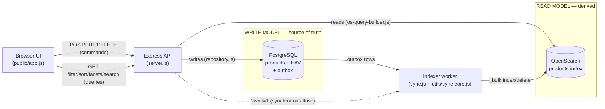
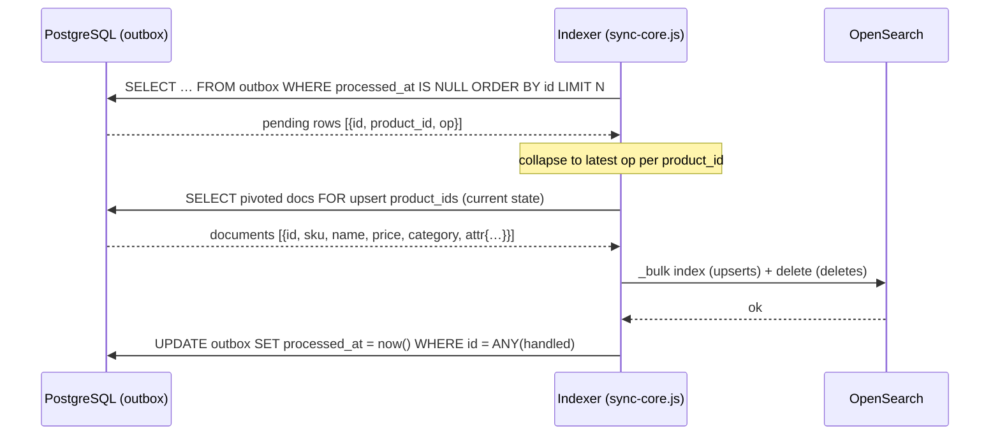

# Architecture — Hybrid EAV + OpenSearch Product Catalog

This document explains **how the system is put together and how the logic
works**: the two data stores and why there are two, how a write flows through
PostgreSQL, how it is **synchronised into OpenSearch**, and how a read is served
from OpenSearch instead of from SQL joins.

> Prerequisite: the EAV write model (schema, typed value columns, create/update
> logic) is unchanged from project `07` — read its `Architecture.md` for the EAV
> details. This document covers only what `08` **adds**: the search read model
> and the sync between the two.

---

## 1. The big picture — one truth, two stores (CQRS)

Project `07` stored products as typed EAV and answered every filter with **N SQL
self-joins** — correct, but the joins fan out and the planner's estimates degrade
as you add predicates (see `07`'s `Architecture.md` §4). It also can't do facet
counts or full-text cheaply.

`08` keeps that EAV database **as the source of truth for writes**, and adds a
**second store optimised for reads**: OpenSearch. This is the
**CQRS** (Command Query Responsibility Segregation) shape:

| | Write model | Read model |
|---|---|---|
| **Store** | PostgreSQL (typed EAV) | OpenSearch |
| **Handles** | `POST` / `PUT` / `DELETE` / seed | `GET /api/products`, `:id`, facets, search |
| **Authority** | source of truth | derived, disposable |
| **Shape** | normalised rows (1 product = 1 + N rows) | 1 denormalised document per product |
| **Rebuildable?** | no — it's the truth | yes — `npm run reindex` from PG |

The two are connected by a **transactional outbox** and a small **indexer
worker**. Everything below is how that connection works.

### Component diagram



The API is the only process that talks to both stores directly; the indexer is
the only thing that **writes** to OpenSearch. Reads never touch Postgres (except a
rare `:id` fallback, §5.3).

---

## 2. What each new piece is (and why it exists)

Everything from `07` is still here. `08` adds five things:

| Piece | File(s) | Job |
|-------|---------|-----|
| **`outbox` table** | `scripts/setup/00_create_schema.sql` | records "product X changed" in the same transaction as the change |
| **Index mapping builder** | `utils/os-mapping.js` | turns attribute metadata into an OpenSearch mapping (typed fields) |
| **OpenSearch client + index lifecycle** | `utils/os-client.js` | connect, create index, bulk-mode, refresh, doc count |
| **Indexer** | `utils/indexer.js`, `utils/sync-core.js`, `sync.js`, `reindex.js` | pivot PG rows → documents, `_bulk` into OpenSearch, drain the outbox |
| **OpenSearch query builder** | `utils/os-query-builder.js` | turn the `07` query-param contract into one OpenSearch query (+facets/text) |

The `attributes` metadata table (from `07`) now does **double duty**: it still
drives the UI and validation, and it now also **defines the OpenSearch field
types** (§4.1). One dictionary, two consumers.

### The outbox table

```sql
outbox (
  id           BIGSERIAL PRIMARY KEY,
  product_id   BIGINT NOT NULL,     -- which product changed
  op           TEXT   NOT NULL CHECK (op IN ('upsert','delete')),
  enqueued_at  TIMESTAMPTZ NOT NULL DEFAULT now(),
  processed_at TIMESTAMPTZ          -- NULL = pending; set once shipped to OS
);
CREATE INDEX idx_outbox_pending ON outbox (id) WHERE processed_at IS NULL;
```

It is a **durable change log** living inside the same database as the data.
`op` says *what kind* of change; the actual document is **not** stored here — the
indexer reads the current product state from PG when it processes the row (§3.3).
The partial index makes "give me the next pending batch" a cheap scan.

---

## 3. How the logic works

Three flows: **write → PostgreSQL**, **PostgreSQL → OpenSearch (sync)**, and
**read ← OpenSearch**.

### 3.1 The write path (command)

`repo.createProduct()` / `updateProduct()` / `deleteProduct()` /
`insertProductsBatch()` in `utils/repository.js`. The EAV write is exactly `07`'s
(entity row + one typed value row per attribute, in a transaction). The **only
addition** is one line inside that same transaction:

```js
// utils/repository.js — createProduct(), simplified
await client.query('BEGIN');
const { rows } = await client.query(
  `INSERT INTO products (sku, name, category_id, price)
   VALUES ($1,$2,(SELECT id FROM categories WHERE code=$3),$4) RETURNING id`, …);
const productId = rows[0].id;
for (const a of attrRows) {
  await client.query(`INSERT INTO product_attribute_values (…) VALUES (…)`, …);
}
await enqueueOutbox(client, productId, 'upsert');   // ← the outbox row, SAME tx
await client.query('COMMIT');
```

**Why in the same transaction?** This is the crux of the whole design. Because the
outbox `INSERT` commits **atomically** with the product/value rows:

- if the transaction commits → the change **and** its outbox event are both
  durable; the indexer will see it.
- if the transaction rolls back → **neither** exists; the indexer never learns
  about a product that was never really created.

There is no window where the data and the "please index me" signal disagree.
Contrast with "write to PG, then call OpenSearch" (dual-write): a crash between
the two leaves the stores permanently diverged. The outbox removes that window by
turning "notify the index" into a plain row in the same commit.

### 3.2 The sync path — outbox → OpenSearch

The indexer (`utils/sync-core.js`, run as a daemon by `sync.js`) repeats one
cycle, `drainOnce()`:



Step by step, and *why each step is shaped that way*:

1. **Claim a batch** — read up to `SYNC_BATCH` pending rows in `id` order (id
   order = commit order, so changes apply in the order they happened).
2. **Collapse to the latest op per product** — if a product was updated three
   times in the batch, we only need to index it **once**, with its *final* state.
   `sync-core.js` keeps a `Map<product_id, op>` where the last (highest-id) row
   wins.
3. **Read current state from PG, not from the outbox** — for every `upsert`
   product_id we run the pivot `SELECT` (`utils/indexer.js`, `docsForIds`) that
   turns the EAV rows into one flat `attr` object. This is why the outbox needn't
   store the document: the truth is always re-read fresh, so even stale/duplicate
   events converge to the correct current document.
4. **Apply via `_bulk`** — one bulk request with `index` actions (upserts, keyed
   by product `id`) and `delete` actions. A product queued as `upsert` but since
   deleted won't come back from the `SELECT`, so it's folded into the deletes
   (defensive — `missingUpserts` in `sync-core.js`).
5. **Mark processed last** — `UPDATE outbox SET processed_at = now()` only *after*
   OpenSearch acknowledged. Ordering matters (§6.1).

`docsForIds()` is the pivot — the reconstruction `07` paid **per query** now runs
**once per change**:

```sql
-- utils/indexer.js (PIVOT_SELECT), for a set of product ids
SELECT p.id, p.sku, p.name, p.price::float8 AS price, cat.code AS category, p.created_at,
  jsonb_object_agg(a.code,
    CASE a.data_type
      WHEN 'text'   THEN to_jsonb(pav.value_text)
      WHEN 'number' THEN to_jsonb(pav.value_number::float8)
      WHEN 'bool'   THEN to_jsonb(pav.value_bool)
      WHEN 'date'   THEN to_jsonb(pav.value_date)
    END) FILTER (WHERE a.code IS NOT NULL) AS attr
FROM products p
JOIN categories cat ON cat.id = p.category_id
LEFT JOIN product_attribute_values pav ON pav.product_id = p.id
LEFT JOIN attributes a ON a.id = pav.attribute_id
WHERE p.id = ANY($1) GROUP BY p.id, cat.code;
```

The `to_jsonb(... ::float8)` / typed casts matter: numbers arrive at OpenSearch as
JSON numbers (not strings), bools as bools, dates as `'YYYY-MM-DD'` — matching the
field types the mapping declares (§4.1).

### 3.3 The read path (query)

`GET /api/products` (`server.js`) never joins. It builds one OpenSearch body and
runs one search:

```js
const q = buildProductQuery(req.query, META);            // os-query-builder.js
const { body } = await os.getClient().search({ index: 'products', body: q.body });
res.json({
  items: body.hits.hits.map(h => docToItem(h._source)),
  total: body.hits.total.value,       // no separate COUNT query
  facets: shapeFacets(body.aggregations),
  took: body.took, …
});
```

`GET /api/products/:id` does an OpenSearch `get` by id, and **falls back to PG**
(`repo.getProduct`) only on a 404 — i.e. a product written microseconds ago that
the indexer hasn't shipped yet. That fallback is the one place a read touches the
source of truth, and it exists purely to paper over sync lag for a just-created
item.

---

## 4. How we use OpenSearch

### 4.1 The index mapping is generated from attribute metadata

An OpenSearch index has a **mapping** (its schema). Rather than hand-write it or
let OpenSearch guess types dynamically (which would infer `"8"` as text, breaking
numeric sort), we **build the mapping from the `attributes` table** — the same
dictionary that types the EAV columns. `utils/os-mapping.js`:

```js
function fieldForType(dataType) {
  switch (dataType) {
    case 'number': return { type: 'double' };                       // range + numeric sort
    case 'bool':   return { type: 'boolean' };
    case 'date':   return { type: 'date', format: 'yyyy-MM-dd' };
    case 'text':   return { type: 'keyword', fields: { text: { type: 'text' } } };
  }                             //          ^ exact/facet/sort        ^ analyzed, for full-text
}
```

The document has core fields plus one `attr.<code>` field per attribute:

```jsonc
// what a product looks like in the index
{
  "id": 3001, "sku": "LP-2001", "name": "UltraBook 14 Ryzen laptop",
  "category": "laptops", "price": 1299.0, "created_at": "2026-01-04T…",
  "attr": { "cpu": "Ryzen 7", "ram_gb": 32, "tdp_w": 28, "touchscreen": true }
}
```

Field-type mapping (the OpenSearch equivalent of `07`'s typed `value_*` columns):

| EAV `data_type` | OpenSearch field | Why |
|-----------------|------------------|-----|
| `text`   | `keyword` + `.text` sub-field | keyword = exact filter, **term facets**, sort; `.text` = analyzed full-text |
| `number` | `double` | range filters (`ram_gb >= 16`), correct numeric sort, stats aggregations |
| `bool`   | `boolean` | filter + term facet |
| `date`   | `date` (`yyyy-MM-dd`) | range filters, sort |
| core `name` | `text` + `name.raw` keyword | full-text on `name`, exact/sort on `name.raw` |

`mappings.dynamic: 'strict'` means an unmapped field is an error, not a silent
guess — types stay correct and stable. Adding an attribute → regenerate the
mapping (`os:create --force`) and `reindex`.

### 4.2 The query builder — same contract as `07`, different engine

`utils/os-query-builder.js` deliberately accepts the **identical query params** as
`07`'s SQL builder, so the two are directly comparable. The difference is what
each param compiles to:

| Param | `07` (SQL) | `08` (OpenSearch) |
|-------|-----------|-------------------|
| `category=tshirts` | `WHERE cat.code='tshirts'` | `{ term: { category: 'tshirts' } }` |
| `f_color=red` | **a self-join** on the value table | `{ term: { 'attr.color': 'red' } }` |
| `f_ram_gb_gte=16` | self-join + `value_number >= 16` | `{ range: { 'attr.ram_gb': { gte:16 } } }` |
| `price_lt=100` | `p.price < 100` | `{ range: { price: { lt:100 } } }` |
| `sort=ram_gb&dir=desc` | LEFT JOIN + `ORDER BY value_number` | `sort: [{ 'attr.ram_gb':'desc' }]` |
| `q=ryzen` | *(not supported)* | `multi_match` over `name` + `attr.*.text` |
| `facets=color,size` | *(N GROUP BY joins)* | `aggs` (one round trip) |

All the attribute predicates land in the `bool.filter` array — non-scoring,
cacheable, ANDed. Adding a filter appends **one clause**; there is no join to fan
out. The whole thing is one request:

```jsonc
{
  "track_total_hits": true,
  "query": { "bool": {
    "filter": [
      { "term":  { "category": "tshirts" } },
      { "term":  { "attr.color": "red" } },
      { "term":  { "attr.size": "M" } },
      { "range": { "price": { "lt": 100 } } }
    ]
  }},
  "sort": [ { "price": "asc" } ],
  "from": 0, "size": 20,
  "aggs": { "color": { "terms": { "field": "attr.color" } }, "price": { "stats": { "field": "price" } } }
}
```

**The same metadata guardrails as `07` still apply** — only `is_filterable`
attributes may be filtered, only `is_sortable` sorted, and every code is validated
against the whitelist before it reaches the query body. That both prevents
injecting arbitrary field names and keeps the two projects' semantics identical.

### 4.3 Facets and full-text — what the search engine adds

- **Facets** (`aggs`): the whole filter sidebar — "Red (42), Blue (30)…", price
  min/avg/max — computed in the **same** request as the hit list. Text/bool
  attributes → `terms` buckets; numbers → `stats`. In SQL EAV each facet is a
  separate `GROUP BY` self-join; here they're one round trip over doc-values.
  `server.js:shapeFacets()` flattens the raw aggregation output for the UI.
- **Full-text** (`q=`): a `multi_match` over `name^2` and every text attribute's
  `.text` sub-field, combined with the same filters/sort/facets. This is why the
  mapping gives text attributes an analyzed `.text` sibling — `"ryzen"` matches
  `"Ryzen 7"` because the analyzer tokenises/lowercases it, which a bare `keyword`
  would not.

### 4.4 Index lifecycle

`utils/os-client.js` centralises it so setup, reindex, and `os:create` share one
path: `createIndex({force})` (drop+recreate with the generated mapping),
`setBulkMode(on)` (toggles `refresh_interval` between `-1` and `1s` so a backfill
isn't refreshing after every batch), `refresh()`, `docCount()`, and
`waitForCluster()` (used at startup because the container may still be booting).

---

## 5. How OpenSearch stays in sync with PostgreSQL

Three mechanisms cover three situations: **steady-state** (incremental),
**instant** (synchronous), and **rebuild** (backfill).

### 5.1 Incremental — the outbox worker (steady state)

The default. `npm run sync` runs the loop from §3.2 forever, polling every
`SYNC_INTERVAL_MS`. New writes enqueue outbox rows; the worker drains them within
a poll interval. This is a **CDC-lite** design: instead of tailing Postgres' WAL
(Debezium-style), the application explicitly records changes in a table it
controls. Cheaper to run, and the events carry exactly the granularity we want
(one per product change).

### 5.2 Synchronous — `?wait=1` (read-your-write for the UI)

Eventual consistency is usually fine, but a user who just saved a product expects
to see it in the list immediately. Any write endpoint accepts `?wait=1`, which
makes the API **drain the outbox and refresh the index before responding**
(`server.js:maybeWait` → `sync-core.drainAll` + `os.refresh`). The UI uses it on
save/seed so the change is searchable the instant the request returns. It reuses
the *same* drain logic as the worker — it's not a second code path, just a
synchronous invocation of the same one.

### 5.3 Rebuild — full backfill (`reindex.js`)

Because OpenSearch is derived, it can always be regenerated from PG. `npm run
reindex` drops the index, recreates it from the current mapping, streams **all**
products in id-order pages (`docsPage`), bulk-loads them with refresh disabled,
then marks any pending outbox rows processed (a full rebuild supersedes queued
deltas). Used after the initial seed (`setup-database.js` does it inline) and any
time the mapping changes or the index is wiped. This is the safety net that makes
losing/corrupting the index a non-event.

### 5.4 Why this is correct — the guarantees

- **No lost updates.** The outbox row commits with the data (§3.1), so every
  committed change has a durable event. The worker only marks rows processed
  after OpenSearch acks (§3.2 step 5).
- **At-least-once, made safe by idempotency.** If the worker crashes *after* the
  `_bulk` but *before* the `UPDATE outbox`, those rows are still pending and get
  re-processed next run. Re-processing is harmless because every op is an
  **idempotent upsert/delete keyed by product `id`** — re-indexing the same
  current state produces the same document. (Exactly-once is unnecessary once ops
  are idempotent.)
- **Convergence over ordering.** The worker always indexes the **current** PG
  state, not a captured diff, and collapses multiple events per product to the
  latest. So even out-of-order or duplicated events converge to the correct
  document. The `id`-ordered scan additionally applies changes in commit order.
- **Deletes handled explicitly.** `deleteProduct` enqueues `op='delete'`; the
  worker issues a bulk delete. A product deleted while an `upsert` was queued is
  folded into deletes because the pivot `SELECT` returns nothing for it.

### 5.5 The cost — eventual consistency and its bounds

The index trails PG by at most **one poll interval + OpenSearch's refresh
interval** (sub-second by default). During that window search can miss a
just-written product or show a just-deleted one. Mitigations in this repo:
`?wait=1` for the interactive path, and the PG fallback in `GET
/api/products/:id`. The `GET /api/sync/status` endpoint (pending outbox count +
indexed doc count) makes the lag observable; the UI shows it in the header strip.

### 5.6 Why the outbox rather than the alternatives

| Approach | Consistency | Latency | Ops cost | Verdict here |
|----------|-------------|---------|----------|--------------|
| **Outbox + indexer** (this repo) | reliable, eventual | low (poll) | one worker + a table | idempotent, replayable, simple to reason about ✅ |
| Synchronous dual-write | can permanently diverge on partial failure | lowest | none | no retry/repair — unsafe alone; we keep it only as the `?wait=1` *optimisation* on top of the outbox |
| CDC from WAL (Debezium) | reliable, eventual | low | Kafka + Connect | captures out-of-band SQL too, but heavy infra for a demo |
| Periodic full reindex only | stale between runs | high | trivial | fine for tiny/rarely-changing catalogs; O(catalog) each cycle |

The outbox is the sweet spot: transactional correctness without external
infrastructure, and the full reindex is always available as the repair tool.

---

## 6. Tricks & gotchas

### 6.1 Sync
- **Mark processed *after* the bulk, never before.** Marking first would drop
  events if the bulk failed. Marking after means at-least-once, which idempotency
  makes safe.
- **Read current state, don't ship the payload in the outbox.** Storing the
  document in the outbox would let a stale payload overwrite a newer one;
  re-reading from PG guarantees the newest state wins and shrinks the outbox row.
- **Collapse per product before indexing.** A hot product edited many times in one
  batch should cost one `_bulk` op, not many.
- **`FOR UPDATE SKIP LOCKED`** (noted in `sync.js`) is what lets you run multiple
  workers safely if one ever isn't enough — each grabs a disjoint batch.
- **A full `reindex` clears pending outbox rows** — otherwise the worker would
  redundantly re-ship changes the backfill already applied.

### 6.2 OpenSearch usage
- **`dynamic: 'strict'` mapping** — fail loudly on an unmapped field rather than
  let OpenSearch guess a type. A new attribute is a deliberate `os:create --force`
  + `reindex`, not an accident.
- **`keyword` for facets/exact, `.text` for search** — mixing them up gives you
  either un-aggregatable text fields or full-text that only matches whole values.
- **Numbers must reach the index as numbers.** The pivot casts
  `value_number::float8` and uses `to_jsonb`, so `ram_gb` is `32`, not `"32"` —
  otherwise range/sort silently misbehave.
- **`track_total_hits: true`** so `total` is exact for pagination (OpenSearch
  otherwise caps the counted total at 10k).
- **Bulk backfill with `refresh_interval:-1`**, restored afterwards — refreshing
  after every batch during a 30k load is the classic reindex performance trap.

### 6.3 Consistency
- **Don't read-after-write from OpenSearch without `?wait=1`** (or a refresh) —
  the doc may not be visible yet. The `:id` PG fallback exists for exactly this.
- **The index is disposable; the outbox + PG are not.** Treat any index
  divergence as "reindex", never as "hand-patch the index".

---

## 7. Summary

- **Two stores, one truth.** PostgreSQL (typed EAV, from `07`) is the write model
  and source of truth; OpenSearch is a **derived, rebuildable read model**.
- **The logic:** writes go to PG and drop an **outbox** row in the *same
  transaction*; an **indexer** drains the outbox, re-reads current state, pivots
  it to a document, and `_bulk`s it into OpenSearch; reads are a single OpenSearch
  query with facets and full-text — no joins.
- **OpenSearch usage:** the index **mapping is generated from attribute
  metadata** so every field is correctly typed; the query builder compiles the
  same param contract as `07` into one `bool` query plus aggregations.
- **Sync:** transactional outbox (no lost updates) + idempotent, id-keyed bulk ops
  (safe at-least-once) + `?wait=1` for read-your-write + full `reindex` as the
  rebuild/repair path. The trade is **eventual consistency** for flat read
  latency, facets, and full-text — the classic CQRS bargain.
```
